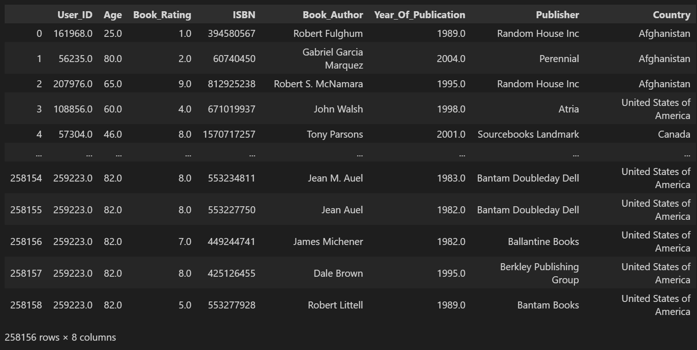
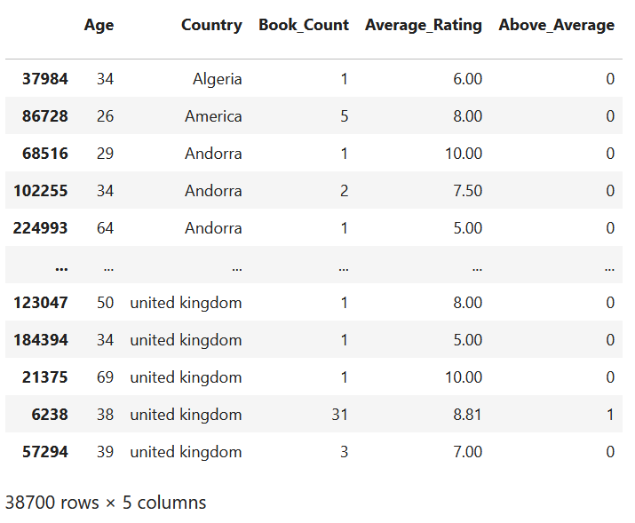

# Book Crossing

Project status: Using SQL, we combined 3 CSV files into a single dataset. We then cleaned that dataset several times over to ensure there were no null values, duplicates, or other undesireable data points. As we have worked on our analysis, our dataset has turned into multiple datasets again. For our machine learning model, we created a new dataset by shaving our data down to 38,700 rows & 6 columns. After splitting the data we fit the model and assessed its accuracy. We also have begun to visualize our data using Tableau, the results of which are shown in the deliverable 2 section below.

## Deliverable 1

Overview: Our group is interested in creating a book tracking app, but first we need some insight on certain countries or age groups that would be the target audience. We decided to take a look at the Book Crossing data and find for some answers.

Original Dataset Link: Our group is using the Book Crossing data set available on the [Institut für Informatik Freiburg](http://www2.informatik.uni-freiburg.de/~cziegler/BX/) website.  
    
1. Reason for choosing the data set: We decided on this dataset as we all found a mutual appreciation for literature, and decided to look for a large       data set incorporating books as the main focus.
2. Description of the data: This dataset has 9 columns, those being: User_ID, Age, Address, Book_Rating, ISBN, Book_Title, Book_Author,     Year_Of_Publication, and Publisher. This is a large dataset, with 263,008 rows of data, even after cleaning out null values and setting an accepted age range of 10-85 years, removing ratings of 0, and changing Address to just Country.
3. Questions that the team plans to answer with the project: 
- Do certain authors stand out in terms of rating or some other metric?
- Are there certain countries that utilize bookcrossing more?
- Are there certain age groups that track more books?
4. Data Cleaning Process: 
Created tables using PostgresSQL in pgAdmin and imported the data of three csv files into the the approriate table. Combiend all three tables into the book_crossing_dataset table using left joins. Exported the table as a csv file called book_crossing_data. Opened the file in Jupyter Notebook to remove null values, ages over the age of 85, and ages under 10, as well as removing any rows with a publication date or a book rating of 0.

Links:

Entity Relationship Diagram (ERD) (Once in main branch add that link):
We used [QuickDB](https://app.quickdatabasediagrams.com/#/) to create the entity relationship diagram

SQL Table Queries (Once in main branch add that link): https://github.com/PGComai/Data_Analytics_Final_Project/blob/main/SQL/Book_crossing_data.sql

SQL Join Queries (Once in main branch add that link): https://github.com/PGComai/Data_Analytics_Final_Project/blob/main/SQL/joins.sql

Clean Dataset link (Once in main branch add that link): https://github.com/PGComai/Data_Analytics_Final_Project/blob/m_learning/CSV/02.08.23_clean.csv

Tableau Dashboard/Story Link: https://public.tableau.com/app/profile/ryan7750/viz/BookAnalysis_16764326478180/Dashboard1?publish=yes

Presentation Link: https://docs.google.com/presentation/d/1vRV38NYPL31NVa37Tg1ylln4VgKnkeOAEaq2_KUAiko/edit?usp=sharing 

Summary:
 Next steps: 1. Create a basic machine learning model (Include a confusion matrix and accuracy score)
 2. Flesh out presentation (Make it easy to look at)
 3. Reorganize github branches to be more sectional instead of personal
 
## Deliverable 2

### Dataset dimensions

Default data:

Machine learning data:

Machine learning results:

### Visualization

Tableau visualization:

